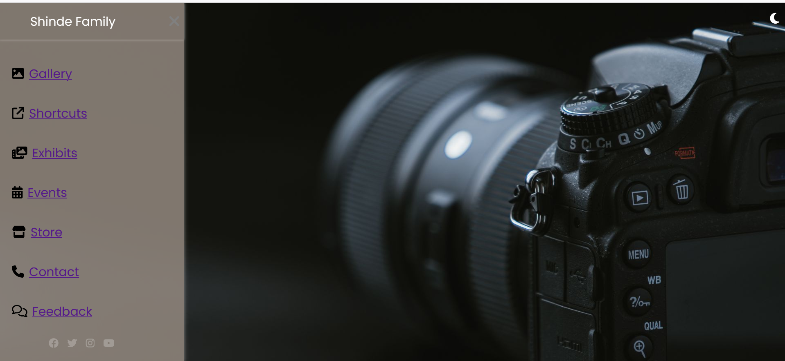
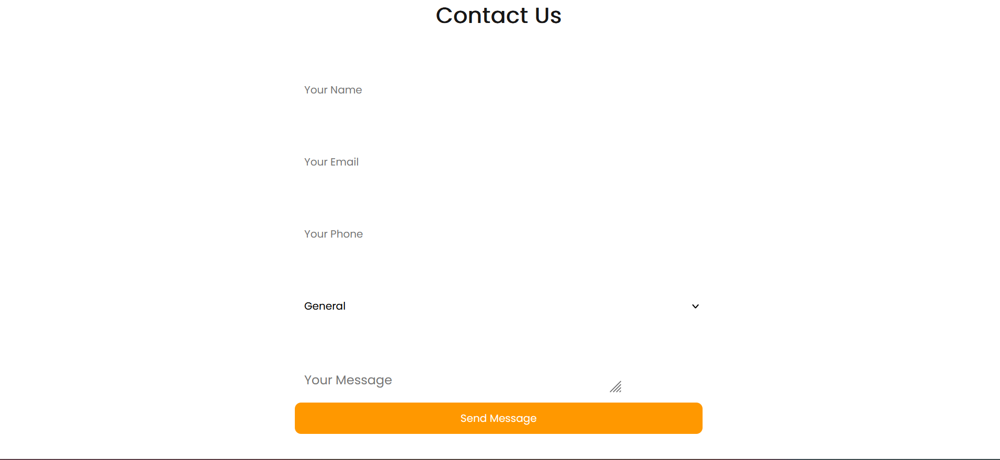

# 🏡 Shinde Family Mini Website

A fully responsive, animated **family-themed mini website** showcasing a gallery, events, store, and more — built using **HTML, CSS, and JavaScript**.  
This project demonstrates **sidebar navigation, theme toggling, modal image previews, responsive design, and interactive forms**.

---

## 📌 Features
- **Sidebar Navigation** – Smooth slide-in/out menu with icons.
- **Theme Toggle** – Switch between Dark & Light mode with one click.
- **Responsive Design** – Optimized for desktop, tablet, and mobile devices.
- **Gallery** – 12-image responsive grid with modal popup previews.
- **Shortcuts Page** – Quick access to important family links.
- **Exhibits Page** – Highlight family achievements & memories.
- **Events Page** – Upcoming events table + past highlights.
- **Store Page** – Product cards with prices & “Buy Now” buttons.
- **Contact Page** – Full contact form + embedded Google Map.
- **Feedback Page** – Star rating system + feedback form.

---

## 🗂 Project Structure
```
📂 project-folder/
 ├── index_enhanced.html      # Homepage with welcome & navigation
 ├── gallery.html             # Family gallery page
 ├── shortcuts.html           # Quick links page
 ├── exhibits.html            # Family memories page
 ├── events.html              # Events calendar & highlights
 ├── store.html               # Family store / products
 ├── contact.html             # Contact form & map
 ├── feedback.html            # Feedback form with ratings
 ├── style_enhanced.css       # Main stylesheet
 ├── photo.jpg                # Sample image
 ├── Screenshot1.png          # Sidebar screenshot
 ├── Screenshot2.png          # Contact form screenshot
 └── README.md                # Project documentation
```

---

## 🚀 How to Run
1. **Download or Clone this Repository**  
   ```bash
   git clone https://github.com/aishwaryash775/shinde-family-website.git
   ```
2. **Open `index_enhanced.html`** in your web browser.
3. Use the **sidebar menu** to navigate between pages.
4. Toggle between **light & dark mode** from the top-right button.

---

## 💡 Technologies Used
- **HTML5**
- **CSS3** (Flexbox, Grid, Animations, Media Queries)
- **JavaScript** (Theme toggle, Modal popup, Form interactions)
- **Font Awesome** for icons
- **Google Fonts** (Poppins)

---

## 📸 Screenshots
### Sidebar Navigation  


### Contact Form  


---

## ✨ Future Improvements
- Add backend for form submissions.
- Store feedback and contact messages in a database.
- Add authentication for members-only pages.

---

## 👩‍💻 Author
**Aishwarya Santosh Shinde**  
📧 Email: aishwaryash880@gmail.com  
🔗 GitHub: [aishwaryash775](https://github.com/aishwaryash775)  
🔗 LinkedIn:(https://www.linkedin.com/in/aishwaryashinde)
